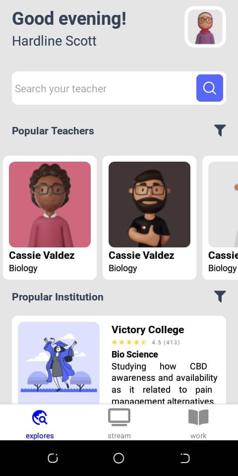

## About the Project

This project is an educational mobile application developed with React Native. It serves as a showcase to demonstrate my abilities as a mobile developer, focusing on the use of modern technologies and best development practices.

## Technologies Used

- React Native
- Expo
- JavaScript
- Tailwind CSS

## Screenshots

